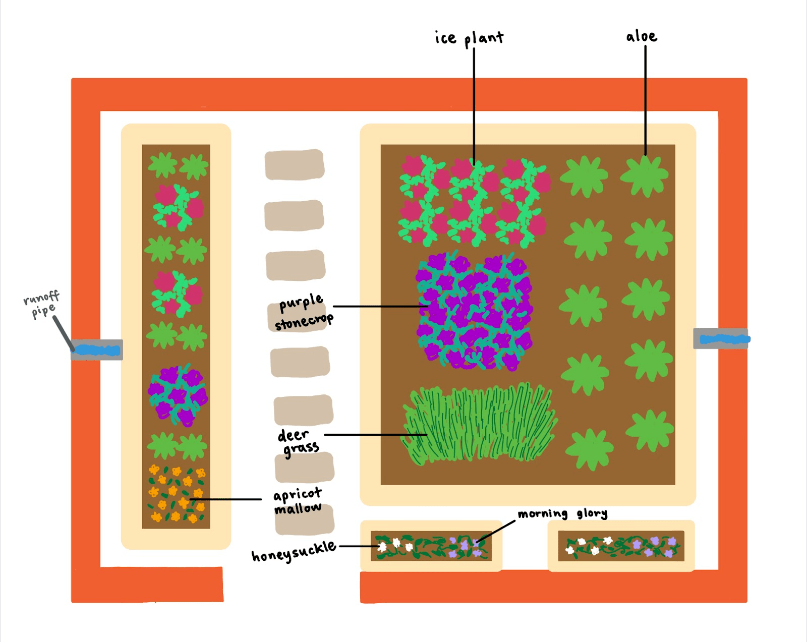
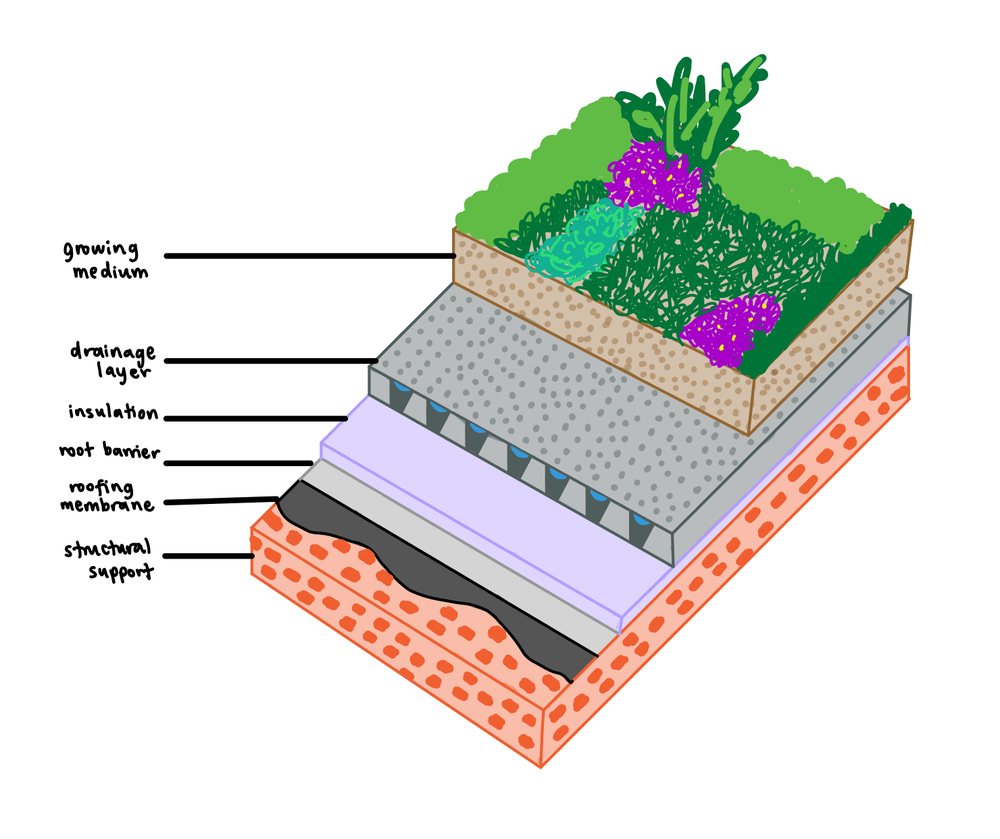
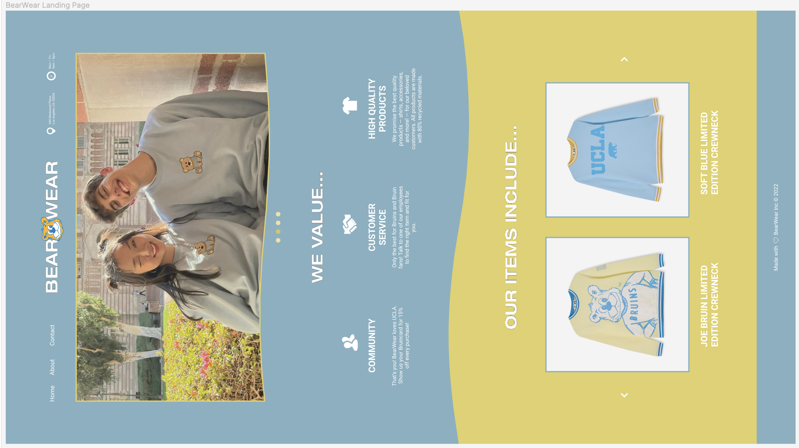

<link rel="shortcut icon" type="image/x-icon" href="favicon.ico">

# projects
### GEOG 5HC ~ Sustainable Environmental Design: An Exploration of Green Roofs
I researched and designed a green roof that could feasibly be implemented at UCLA!

Check out the full paper I wrote for this project [here](https://drive.google.com/file/d/19DwKa4WBqSAEJacNKw317isk-yTlM7Dy/view?usp=sharing).

### CREATIVE CHALLENGE ~ BearWear Landing Page
I designed a landing page for a hypothetical UCLA apparel shop called BearWear as part of an application!

This ended up being a super fun creative project that allowed me to dive deeper into my own design preferences, starting completely from scratch.

# relevant coursework
### Cognitive Science
- Psychology 85: Introduction to Cognitive Science
- Psychology 100A: Psychological Statistics
- Psychology 100B: Research Methods in Psychology
- Psychology 115: Behavioral Neuroscience
- Psychology 120A: Cognitive Psychology

### Computing
- Computing 10A: Introduction to Programming in C++
- Computing 10B: Intermediate Programming in C++
- Computing 16A: Python & Applications
- Statistics 20: Programming with R

### Statistics
- Statistics 10: Introduction to Statistical Reasoning
- Statistics 20: Programming with R
- Statistics 100A: Introduction to Probability
- Statistics 100B: Introduction to Mathematical Statistics
- Statistics 101A: Introduction to Data Analysis and Regression

