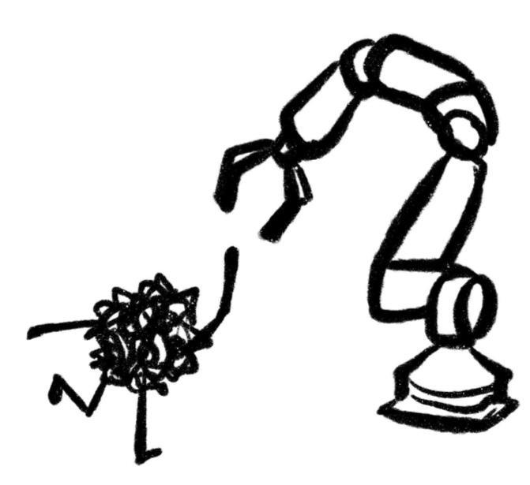

<link rel="shortcut icon" type="image/x-icon" href="favicon.ico">

# hi, i'm diya!

I'm an undergrad at UCLA studying Cognitive Science with a specialization in Computing and a minor in Statistics. 

I'm extremely drawn to the intersection of art, psychology, and technology — currently, I am a UX design intern at [Rivet](https://www.rivet.app/) and a designer for [LA Blueprint](https://lablueprint.org/)'s upcoming [Skid Row Arts Alliance](https://www.skidrowartsalliance.com/) mobile app.
