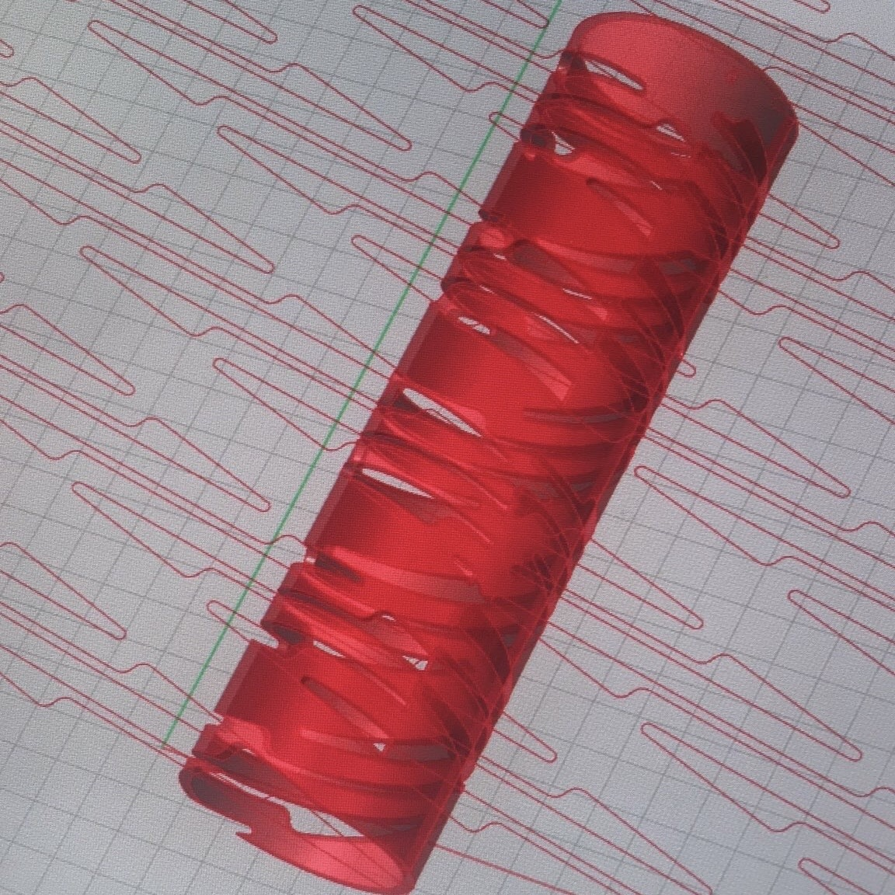

<link rel="shortcut icon" type="image/x-icon" href="favicon.ico">

# [hello there!](https://www.youtube.com/watch?v=rEq1Z0bjdwc)
I am a rising junior at MIT (class of 2024). My major is Mechanical Engineering with a focus in Learning Machines and Physical Systems, and I'm also minoring in math. Currently an undergrad researcher (UROP) under Pulkit Agrawal with the [Improbable AI Group](https://people.csail.mit.edu/pulkitag/) and under Daniela Rus with the [Distributed Robotics Lab](https://www.csail.mit.edu/research/distributed-robotics-laboratory) at MIT CSAIL.

### research interests
- robust autonomy
- robotic manipulation and motion planning
- loss of function robotics
- mechanical design
- deep learning
- space systems

### other passions
- education accessibility
- housing and healthcare equity
- queer studies ([see my current reading list](https://bpl.bibliocommons.com/list/share/1900259209_alinasarmiento/1900265989_queer_literature))

more about me ~ I currently live in Cambridge, Massachusetts but I come from Newark, California in the SF Bay Area. My pronouns are they/all. I am a serial sock mismatcher.

### contact me
I can be found by email at alinasar [at] mit [dot] edu. Come say hi!

* * *

# research

### currently...

- **Learning Robotic Motion Planning Without 3D Models** ~ _Improbable AI Group (MIT CSAIL)_
    
    I'm working with Anthony Simeonov in exploring robotic grasp generation given 3D point clouds of novel/unseen objects and cluttered scenes. 
    
    Current questions: Can we take task/motion planning into account when generating grasps? What are ways to allow for subgoal search given an ultimate goal and potentially unfavorable initial object configurations?
    
    Using: PyTorch, ROS, PointNet++ architecture, GraspNet architecture, CVAEs, Docker, PyBullet, RViz

- **Computational Design of Fluidic Sensors** ~ _Distributed Robotics Lab (MIT CSAIL)_
    
    I'm assisting Lilly Chin to create computational design tools and pipelines for fluidic and tactile sensor prototyping. We're focusing on adding sensor capability to her work on handed shearing auxetics (HSAs), as well as iterating on the team's tactile sensors for soft robotic grasping.
    
    Using: Grasshopper, Rhino, Rhinoscript, basic electronics

### previously...

- **Venous Materials** ~ _Tangible Media Group (MIT Media Lab)_
    
    I worked with postdoctoral student Hila Mor and faculty advisor Hiroshi Ishii to help develop a more user intuitive interface for Venous Materials: physical fluidic circuits and veins as pressure and deformation sensors. Helped develop a method to print the designs using a novel type of nonplanar 3D printing, as well as streamlining the user interface of the design tool and prototyping different types of logic gate primitives.
    
    Used: Grasshopper3D, Rhino

* * *

# art
### PNR Comics

I'm behind PNR Comics (Procrastinate, Nap, Repeat) at *The Tech*, MIT's student-run newspaper. Read the archive [here](https://thetech.com/photographers/alina-sarmiento). Ideas for a strip? Comments, thoughts, feedback? Email me at alinasar [at] mit [dot] edu !

### Carried - art/poetry zine

Recently, I also made a zine! Inspired by the experiences of my family and others in my community, _Carried_ is a short collection of four illustrated poems about immigration, inter-generational trauma, and Asian American identity. Carried specifically explores the mother-child bond, what it means to leave a place, and the things that we carry with us.
- free to read at [this Google Drive link](https://drive.google.com/file/d/1kc7Rl-Wvum2NmUWpOeS2Mu0YUer4Sq_d/view)
- physical copies are sold at [my Gumroad](https://indoorelephant.gumroad.com/l/carried) 
- I wrote a MIT Admissions guest blog post about it [here](https://mitadmissions.org/blogs/entry/guest-post-art-and-things/)
- and finally, it was a winner of the 2021 MICE Mini-Grant! See the other winning comics [here](https://www.micexpo.org/showcase/#showcase)
