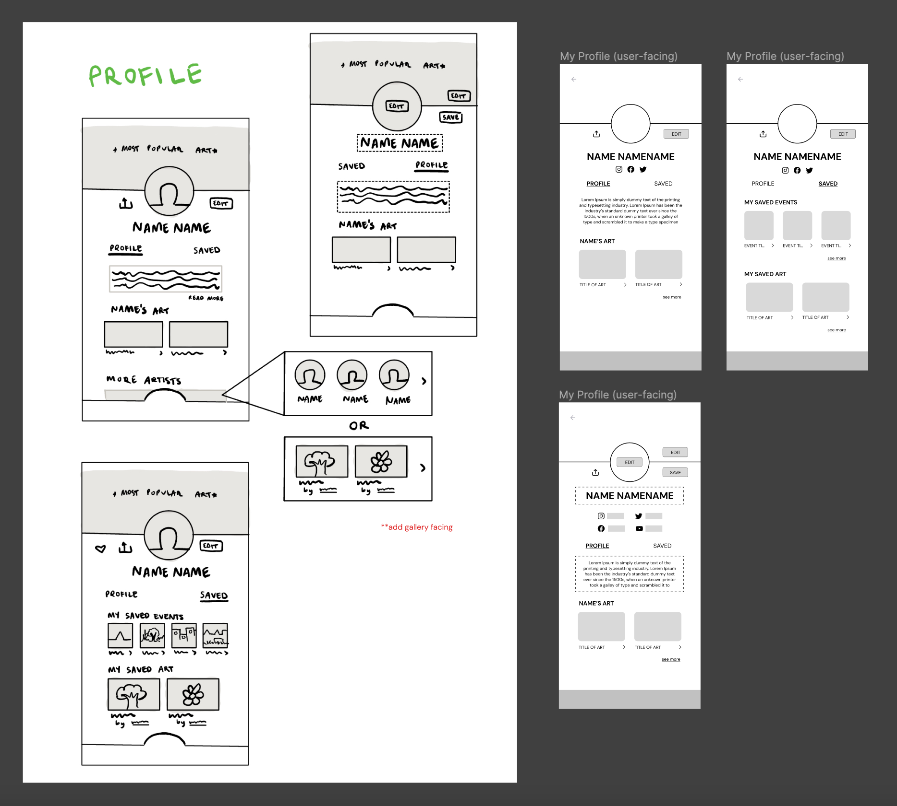

<link rel="shortcut icon" type="image/x-icon" href="favicon.ico">

# currently...

### RIVET APP ~ User Experience and Interface Design

    
I'm working with Rivet, an MIT-based startup, to create an optimal platform for artists to monetize their content and build connections with their top fans. 
    
Using: Figma, Canva, WebFlow, Notion

### LA BLUEPRINT ~ Mobile App User Experience Research and Design

I'm working with LA Blueprint and [Skid Row Arts Alliance](https://www.skidrowartsalliance.com/) to design an easily accessible mobile app to help residents of Skid Row find art workshops and resources, share their art, and foster a tightly-knit art community.

Using: Figma, FigJam, Notion
