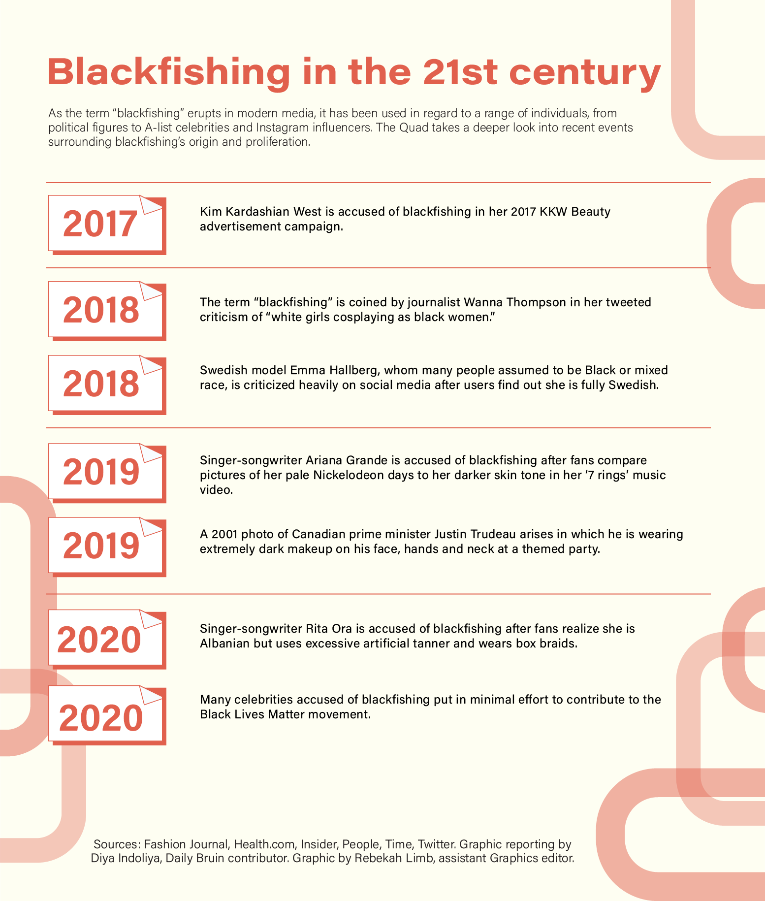

<link rel="shortcut icon" type="image/x-icon" href="favicon.ico">

# my daily bruin articles

Click on the images below to check out the articles I've written for the Daily Bruin thus far!

### UCLA students push for more sustainability programs on campus

### ‘Blackfishing’ harms Black community, highlights societal double standards

### Students prepare for difficult separation from dogs after extended time at home

### Exploring toxic positivity and its effects on college students’ mental health

